# NBHAS Entity Relationship Diagram

## Master ERD

```mermaid
erDiagram

    CUSTOMER ||--o{ ASSESSMENT_SESSION : completes
    ASSESSMENT ||--o{ ASSESSMENT_SESSION : defines
    CATEGORY ||--o{ ASSESSMENT_SESSION : selected_for

    CATEGORY ||--o{ CATEGORY_SYMPTOM : includes
    SYMPTOM ||--o{ CATEGORY_SYMPTOM : appears_in

    SECTION ||--o{ SYMPTOM : groups

    ASSESSMENT_SESSION ||--o{ ASSESSMENT_SYMPTOM : records
    SYMPTOM ||--o{ ASSESSMENT_SYMPTOM : answered_as

    RECOMMENDATION ||--o{ ASSESSMENT_SESSION : issued_for

    RECOMMENDATION ||--o{ RECOMMENDATION_PRODUCT : includes
    PRODUCT ||--o{ RECOMMENDATION_PRODUCT : recommended_in

    RECOMMENDATION ||--o{ RECOMMENDATION_RESOURCE : includes
    RESOURCE ||--o{ RECOMMENDATION_RESOURCE : used_in

    CUSTOMER ||--o{ SHOPIFY_ORDER : places
    ASSESSMENT_SESSION ||--o{ ASSESSMENT_ORDER_LINK : linked_to
    SHOPIFY_ORDER ||--o{ ASSESSMENT_ORDER_LINK : relates_to

    ASSESSMENT_SESSION ||--o{ REPORT : generates
    ASSESSMENT_SESSION ||--o{ COMMUNICATION : sends
    CUSTOMER ||--o{ TIMELINE_EVENT : has
    ASSESSMENT_SESSION ||--o{ TIMELINE_EVENT : creates

    CUSTOMER ||--o{ ADMIN_NOTE : has
    CUSTOMER ||--o{ FOLLOW_UP_TASK : has

    CUSTOMER {
        text CustomerID
        text ShopifyCustomerID
        text FirstName
        text LastName
        email Email
        boolean MarketingConsent
        datetime CreatedAt
        enum Status
    }

    ASSESSMENT {
        text AssessmentID
        text Version
        text Name
        enum Status
        date EffectiveDate
        date RetiredDate
    }

    ASSESSMENT_SESSION {
        text AssessmentSessionID
        text AssessmentID
        text CustomerID
        text CategoryID
        datetime CompletedAt
        int OverallScore
        text RecommendationID
        enum Status
    }

    CATEGORY {
        text CategoryID
        text DisplayCode
        text Title
        text Description
        boolean Active
        int SortOrder
    }

    SECTION {
        text SectionID
        text Name
        int SortOrder
        boolean Active
    }

    SYMPTOM {
        text SymptomID
        text SectionID
        text DisplayName
        text OriginalPDFName
        text NormalizedName
        int SortOrder
        boolean Active
    }

    CATEGORY_SYMPTOM {
        text CategorySymptomID
        text CategoryID
        text SymptomID
        boolean Required
        int SortOverride
        boolean Active
    }

    ASSESSMENT_SYMPTOM {
        text AssessmentSymptomID
        text AssessmentSessionID
        text SymptomID
        enum Severity
        int SeverityScore
        datetime CreatedAt
    }

    RECOMMENDATION {
        text RecommendationID
        text Name
        text Description
        longtext ApplicationInstructions
        text EmailTemplateID
        text PDFTemplateID
        boolean Active
    }

    PRODUCT {
        text ProductID
        text SKU
        text ProductName
        url ProductURL
        boolean Active
    }

    RECOMMENDATION_PRODUCT {
        text RecommendationProductID
        text RecommendationID
        text ProductID
        int DisplayOrder
        boolean PrimaryProduct
    }

    RESOURCE {
        text ResourceID
        text Title
        enum Type
        url URL
        text Description
        boolean Active
    }

    RECOMMENDATION_RESOURCE {
        text RecommendationResourceID
        text RecommendationID
        text ResourceID
        int DisplayOrder
        boolean Required
    }

    SHOPIFY_ORDER {
        text ShopifyOrderID
        text OrderNumber
        text CustomerID
        datetime OrderDate
        decimal Total
        enum Status
    }

    ASSESSMENT_ORDER_LINK {
        text AssessmentOrderLinkID
        text AssessmentSessionID
        text ShopifyOrderID
        text RelationshipType
        datetime LinkedAt
    }

    REPORT {
        text ReportID
        text AssessmentSessionID
        enum ReportType
        url ReportURL
        datetime GeneratedAt
    }

    COMMUNICATION {
        text CommunicationID
        text CustomerID
        text AssessmentSessionID
        enum CommunicationType
        text Subject
        datetime SentAt
        enum Status
    }

    TIMELINE_EVENT {
        text TimelineEventID
        text CustomerID
        text AssessmentSessionID
        enum EventType
        text EventTitle
        datetime EventDate
    }

    ADMIN_NOTE {
        text AdminNoteID
        text CustomerID
        text CreatedBy
        longtext Note
        datetime CreatedAt
    }

    FOLLOW_UP_TASK {
        text FollowUpTaskID
        text CustomerID
        text AssessmentSessionID
        date DueDate
        enum Status
        text TaskType
    }
```

## Key Design Decisions

- Assessment Sessions are permanent and are never edited.
- Customer history is chronological and event-based.
- Assessments and Shopify Orders use a many-to-many relationship.
- Symptoms are master records.
- Customer symptom severity is stored in Assessment Symptom.
- Categories and Symptoms are linked through Category Symptom.
- Recommendations are linked to Products and Resources through relationship tables.
- Shopify remains the commerce source of truth.
